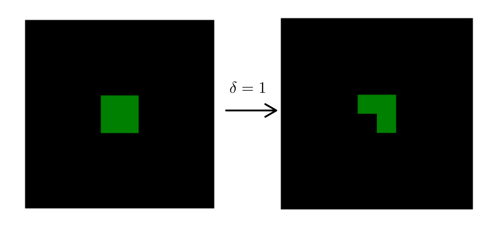

class:  center, middle
background-image: url("Figures/CADIClogo.png")
background-size: 120px
background-position: 5% 5%

```{r xaringan-scribble, echo=FALSE}
xaringanExtra::use_scribble()
#xaringanExtra::use_webcam()
```

# Critical transitions and early warnings in global forest
## [Leonardo A. Saravia](https://lsaravia.github.io)
###  National Council for Scientific and Technical Research [ CONICET ]
###  Austral Center for Scientific Research [CADIC]  
#### 2022/10/04
.small[ Slides available at https://lsaravia.github.io/TipPoints2022]

---
class:  center, middle, inverse
background-image: url(Figures/Deforestation.jpg)
background-size: contain

---
class:  center, middle, inverse
background-image: url(Figures/DeforestationDark.jpg)
background-size: contain

# Global Forest as a Complex systems

--


## Complex systems: emergent behavior
--

### Could not be explained by the behavior of their components

--

### Global forest: these methods can be applied to forests at any place on the earth

???

* I think about forest as a complex system and I talk about global forest
* Because these methods to determine critical can be applied to any place on earth
* Whicht is the main characteristic of complex systems?
* It is emergent behavior 
* the system could react in ways that are not easily predicted by the behavior of the components

---
class:  center, middle, inverse

## Critical transitions

--
### Sudden change of the state of the system

--
### Very large areas provides a better scale to detect critical transitions 

--
### we started with a simple model with two states


???

One of these emergent phenomena are critical transitions 
which produces a sudden change of the state of the system
is important to mention that ...


---
class:  center, middle, inverse

## 1st Order and 2nd Order Critical transitions

.center[

]

---
class:  center, middle, inverse

## 1st Order -->  2nd Order 

.pull-left[

]

--
.pull-right[

]

.small[ Eluding catastrophic shifts - P. Villa Martín https://doi.org/10.1073/pnas.1414708112]


---
class:  center, middle, inverse

## 1st Order -->  2nd Order 

--
### Demographic noise

--
### Short dispersal

--
### Spatial heterogeneity

--
### Dimensionality 

> 1D Systems are extremely sensitive 

> 2D Systems are sensitive 

> 3D Systems less sensitive 

---
class:  center, middle, inverse

## A vegetation model for 2nd order transitions 


---
## A vegetation model for 2nd order transitions 

* Two states **Forest** and **Non-forest** 

--
.center[

]


--
* $\lambda$ is the growth and dispersal rate 

.center[

]


---
## Model dynamics for different $\lambda$ 

* We fixed death rate $\delta = 1$ 

--

.center[

]

--
.pull-left[ 
### There are two transitions

]

--
.pull-right[
#### 1) Connected to fragmented forest
#### 2) Forest to non-forest
]

???
In this simple forest model we have forest and non-forest or empty sites

The state of the system changes with a control parameterr the growth rate called lambda

We have two possible state changes for the system, forest survival, forest extinction
and a third state that is fragmented forest.

So we start from lambda 3 to 2.5, we are simulating that the forest can grow less, 
then from 2.5 to 2.0, the unexpected change is from 2.0 to 1.5 because the system
collapses and the forest go extinct.

---
class:  center, inverse

## Largest patch dynamics 


---
class:  center, inverse

## Largest patch fluctuations 


???
One way to detect the fragmentation transitions is to watch the fluctuations 
of the largest patch, if the fluctuations are small we are far from the critical transitions
if the fluctuations are large we are probabily near a critical point


---

background-image: url(Figures/JaguarFire.jpg)
background-size: contain

---
class:  center, middle, inverse

background-image: url(Figures/JaguarFireDark.jpg)
background-size: contain

# Critical Global Forest 

---
background-image: url(Figures/Saravia2018SciRep.png)
background-size: contain

class: center, bottom

.small[<https://www.nature.com/articles/s41598-018-36120-w>]

???

We applied these ideas to continental regions around the globe
---
class:  center, middle

## Early warnings of fragmentation 

--

### We use remote sensing data (MODIS Vegetation Continuous Field) 

--

### To calculate the fluctuations of the largest patch $RS_{max}$ relative to the total forest area

--

### We defined big continental regions (greater than 10 millons Km²)

--
### We used different forest % thresholds to determine patch sizes 

---
class:  center, middle, inverse

## Early warnings of fragmentation 

--
### A combination of spatial and temporal indicators is more reliable 

--
### When the forest its closer to a critical transition

--
### The size $RS_{max}$ tends to get smaller

--
### Increase its variance

--
### The variation $\Delta RS_{max}$ is biased towards lower values

---
## Largest patch dynamics

.center[

]

.small[
The regions are AF1: Africa mainland, EUAS1: Eurasia mainland, NA1: North America mainland, SAST1: South America tropical and subtropical, SEAS1: Southeast Asia mainland
]

---
class:  center, middle

## Early warnings of fragmentation


---
class:  center, middle

## Regions near a critical transition 

--
### South America tropical and subtropical (SAST1)

--
### Southeast Asia mainland (SEAS1) 

--
### Africa mainland (AF1) met all criteria at least for one threshold

--
### these regions generally experience the biggest rates of deforestation with a significant increase in loss of forest


---

background-image: url(Figures/JaguarFire.jpg)
background-size: contain

---
class:  center, middle, inverse

background-image: url(Figures/JaguarFireDark.jpg)
background-size: contain


# What about multispecies communities?

---
class:  center, middle, inverse

# What about multispecies communities?


.small[ https://dx.doi.org/10.1111/oik.04256]

---
class:  center, middle, inverse

# What about multispecies communities?


---
class:  center, middle, inverse

# What about multispecies communities?


---
class:  center, middle

# Things to do 

---
class:  center, middle, inverse


# Things to do

--
### Check the Power of the method models

--
## Fit forest dynamics with rain/temperature as control variable

--
### Could be applied to other vegetation types

--
### To smaller regions with higher resolutions sensors

---
class:  center, top

## Ecology and Complex Systems Lab 

.pull-left[


<a href="https://twitter.com/ecomplex_lab?ref_src=twsrc%5Etfw" class="twitter-follow-button" data-show-count="false">Follow @ecomplex_lab</a><script async src="https://platform.twitter.com/widgets.js" charset="utf-8"></script>
]


.pull-right[

[Leonardo Saravia [CADIC] ](https://www.researchgate.net/profile/Leonardo-Saravia)

[Maria Piotto [UNC]]()

[Iara Rodriguez [UNGS] ](https://www.researchgate.net/profile/Iara-Rodriguez-2)

[Nicolas Velazco [UNLu]](https://www.researchgate.net/profile/Victor-Velazco)

[Tomas Marina [CADIC]](https://www.researchgate.net/profile/Tomas-Marina)

[Georgina Cordone [CENPAT]](https://www.researchgate.net/profile/Georgina-Cordone)

[Santiago Doyle [UNGS]](https://www.researchgate.net/profile/Santiago-Doyle)

[Vanesa Salinas [UNGS]](https://www.researchgate.net/profile/Vanesa-Salinas-2)

[Fernando Momo[UNGS]](https://www.researchgate.net/profile/Fernando-Momo)
]

---
class:  center, middle, inverse

# The End 

### Slides available at https://lsaravia.github.io/TipPoint2022

